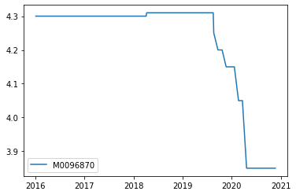

```python
from WindPy import w
```


```python
w.start()
```

    Welcome to use Wind Quant API for Python (WindPy)!
    
    COPYRIGHT (C) 2017 WIND INFORMATION CO., LTD. ALL RIGHTS RESERVED.
    IN NO CIRCUMSTANCE SHALL WIND BE RESPONSIBLE FOR ANY DAMAGES OR LOSSES CAUSED BY USING WIND QUANT API FOR Python.
    


    .ErrorCode=0
    .Data=[OK!]


```python
import pandas as pd
```


```python
# 一年期LPR，从2016年到2021年的数据
```


```python
lpr = w.edb("M0096870", "2016-01-01", "2020-12-19","Fill=Previous")
```


```python
df_lpr = pd.DataFrame(lpr.Data, columns=lpr.Times, index=lpr.Codes).T
```


```python
df_lpr.plot()
```


    <AxesSubplot:>


    

    


```python
# 利用wind接口查询债券信息
```


```python
code=input("请输入债券wind代码")
debtinfo = w.wss(code, "sec_name,comp_name,agency_leadunderwriter,baserate",usedf=True)
debtinfo
```

    请输入债券wind代码123007.SH
    


    (0,
               SEC_NAME       COMP_NAME AGENCY_LEADUNDERWRITER BASERATE
     123007.SH    11微矿债  山东省微山湖矿业集团有限公司             民生证券有限责任公司     None)


```python

```


```python

```
